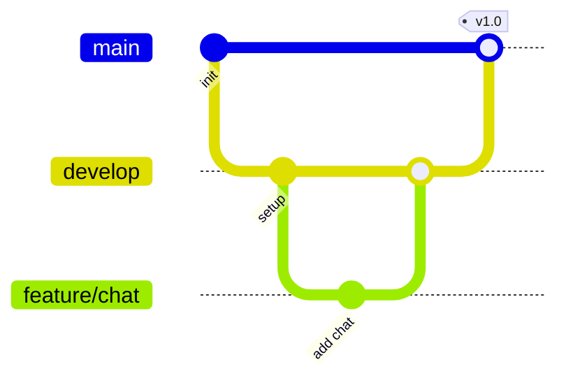

<div align="center">

# 🐾 Petpetni - 寵物社群平台


### 一個以寵物為核心的社群平台，整合社群分享、揪團活動、配對與聊天功能

讓飼主輕鬆交流、分享毛孩生活 🐶🐱

[](https://petpetni.site)
[](package.json)
[](https://vuejs.org/)

[🌐 線上體驗](https://petpetni.site) · [📖 查看文檔](#) · [🐛 回報問題](https://github.com/pet-human-pet/PetPetNi/issues)

</div>

---

## 📖 目錄

- [專案簡介](#-專案簡介-about-the-project)
- [功能特色](#-功能特色-key-features)
- [技術堆疊](#-技術堆疊-tech-stack)
- [專案架構](#-專案架構-project-structure)
- [本地開發環境設置](#-本地開發環境設置-local-development-setup)
- [專案亮點](#-專案亮點-key-highlights)
- [開發規範](#-開發規範-development-standards)
- [測試](#-測試-testing)
- [團隊成員](#-團隊成員-contributors)

---

## 🎯 專案簡介 (About The Project)

<div align="center">


</div>

### 💭 背景與動機

> 許多飼主熱衷於在 Instagram 或 Facebook 上分享寵物照片，讓大家欣賞這些可愛的毛小孩。然而...

```
傳統社群平台的痛點
├─ 寵物資訊被其他生活動態淹沒
├─ 缺乏專為寵物設計的功能
└─ 難以找到附近、個性相投的寵物友伴

Petpetni 的解決方案
├─ 毛孩人格化視角的沉浸式體驗
├─ 解決社交破冰困難，建立同好歸屬感
└─ 帶動線下聚會與知識共享
```

### 🎯 專案目標

<table>
<tr>
<td align="center" width="33%">

<br><b>寵物專屬社群</b>
<br>以毛孩人格化視角<br>打造沉浸感體驗
</td>
<td align="center" width="33%">

<br><b>社交破冰</b>
<br>建立同好歸屬感<br>輕鬆找到志同道合的朋友
</td>
<td align="center" width="33%">

<br><b>帶動發展</b>
<br>線下聚會<br>知識共享
</td>
</tr>
</table>

### 🌐 線上展示

<div align="center">

**[🚀 立即體驗 Petpetni](https://petpetni.site)**

</div>

---

## ✨ 功能特色 (Key Features)

### 🌟 核心功能

<details open>
<summary><b>1. 📱 動態牆 (Social Feed)</b></summary>
<br>

**功能描述**

- 瀏覽貼文動態，進行按讚、留言、分享等互動
- 查看貼文內容與即時回饋

**✨ 技術亮點**

- 瀑布流布局 (Masonry Layout)
- 圖片預覽 Modal
- 原生分享面板 (Web Share API)

</details>

<details>
<summary><b>2. 💬 聊天室 (Real-time Chat)</b></summary>
<br>

**功能描述**

- 流暢的分類及排版
- 完善的即時聊天功能體驗

**✨ 技術亮點**

- 即時聊天 - Supabase Realtime
- 多層級隱私保護
- 互動規則引擎

</details>

<details>
<summary><b>3. 🤖 AI 助手 (AI Assistant)</b></summary>
<br>

**功能描述**

- 任意畫面皆可開啟右側 AI 助手
- 隨時詢問寵物相關問題
- 自動記錄對話內容

**✨ 技術亮點**

- 串接 Gemini API
- 資料庫訊息紀錄
- 人設化對話體驗

</details>

<details>
<summary><b>4. 💝 配對系統 (Smart Matching)</b></summary>
<br>

**功能描述**

- 誰是毛孩的有緣人？
- 讓「一期一會」變成「後會有期」

**✨ 技術亮點**

- 資料驅動配對邏輯
- 五維雷達圖 (Chart.js)
- 智能相容度計算

</details>

---

## 🛠️ 技術堆疊 (Tech Stack)

### 🎨 前端技術棧

<table>
<tr>
<td align="center" width="25%">

<br><b>Vue.js</b>
<br><code>v3.5.24</code>
<br><sub>核心框架</sub>
</td>
<td align="center" width="25%">

<br><b>Pinia</b>
<br><code>v3.0.4</code>
<br><sub>狀態管理</sub>
</td>
<td align="center" width="25%">

<br><b>Tailwind CSS</b>
<br><code>v4.1.18</code>
<br><sub>樣式框架</sub>
</td>
<td align="center" width="25%">

<br><b>Vite</b>
<br><code>v7.2.4</code>
<br><sub>建置工具</sub>
</td>
</tr>
</table>

### ⚙️ 後端技術棧

<table>
<tr>
<td align="center" width="25%">

<br><b>Node.js</b>
<br><code>Active LTS</code>
<br><sub>運行環境</sub>
</td>
<td align="center" width="25%">

<br><b>Express</b>
<br><code>v4.18.2</code>
<br><sub>Web 框架</sub>
</td>
<td align="center" width="25%">

<br><b>Supabase</b>
<br><code>v2.91.0</code>
<br><sub>資料庫服務</sub>
</td>
<td align="center" width="25%">

<br><b>PostgreSQL</b>
<br><code>Latest</code>
<br><sub>關聯式資料庫</sub>
</td>
</tr>
</table>

### 🔧 開發工具與整合服務

<div align="center">

|      類別       | 工具/服務         | 用途               |
| :-------------: | :---------------- | :----------------- |
| 🔄 **版本控制** | Git / GitHub      | 代碼管理與協作     |
| 🚀 **部署平台** | Zeabur            | 前後端自動化部署   |
| ☁️ **雲端儲存** | Cloudinary        | 圖片上傳與優化     |
| 🤖 **AI 模型**  | Google Gemini API | 智慧助手對話       |
| 📊 **即時資料** | Supabase Realtime | WebSocket 即時通訊 |

</div>

---

## 📁 專案架構 (Project Structure)

### 整體架構圖

```
PetPetNi/
│
├── frontend/              # 前端專案 (Vue 3 + Vite)
│   ├── UI Components
│   ├── API Integration
│   └── Responsive Design
│
├── backend/               # 後端專案 (Express + Supabase)
│   ├── API Routes
│   ├── Authentication
│   └── Database Logic
│
└── README.md              # 專案文檔
```

<details>
<summary><b>🎨 前端結構詳細說明</b></summary>

```
frontend/
├── public/                    # 靜態資源
│   ├── favicon.ico
│   └── images/
│
├── src/
│   ├── api/                   # API 請求封裝
│   │   ├── axios.config.js
│   │   └── services/
│   │
│   ├── assets/                # 圖片、字型資源
│   │   ├── images/
│   │   └── fonts/
│   │
│   ├── components/            # Vue 元件
│   │   ├── Chat/              # 聊天室相關
│   │   ├── Matching/          # 配對功能
│   │   ├── Social/            # 社群功能
│   │   └── Common/            # 通用元件
│   │
│   ├── composables/           # 組合式函數
│   │   ├── useAuth.js
│   │   ├── useChat.js
│   │   └── useMatching.js
│   │
│   ├── router/                # 路由設定
│   │   └── index.js
│   │
│   ├── stores/                # Pinia 狀態管理
│   │   ├── auth.js
│   │   ├── chat.js
│   │   └── matching.js
│   │
│   ├── styles/                # 全域樣式
│   │   ├── main.css
│   │   └── tailwind.config.js
│   │
│   ├── utils/                 # 工具函數
│   │   ├── helpers.js
│   │   └── validators.js
│   │
│   ├── views/                 # 頁面視圖
│   │   ├── Home.vue
│   │   ├── Profile.vue
│   │   └── Chat.vue
│   │
│   ├── App.vue                # 根元件
│   └── main.js                # 入口檔案
│
├── .env                       # 環境變數
├── index.html
├── vite.config.js
└── package.json
```

</details>

<details>
<summary><b>⚙️ 後端結構詳細說明</b></summary>

```
backend/
├── src/
│   ├── controllers/           # 控制器
│   │   ├── authController.js
│   │   ├── chatController.js
│   │   └── matchingController.js
│   │
│   ├── routes/                # API 路由
│   │   ├── auth.js
│   │   ├── chat.js
│   │   └── matching.js
│   │
│   ├── services/              # 業務邏輯
│   │   ├── supabaseService.js
│   │   ├── geminiService.js
│   │   └── cloudinaryService.js
│   │
│   └── index.js               # 伺服器入口
│
├── .env                        # 環境變數
├── package.json
└── README.md
```

</details>

---

## 🚀 本地開發環境設置 (Local Development Setup)

### ✅ 環境需求

在開始之前，請確保您的電腦已安裝：

<table>
<tr>
<td align="center">

<br><b>Node.js</b>
<br><code>>= 20.0.0</code>
<br><sub>(建議使用 LTS 版本)</sub>
</td>
<td align="center">

<br><b>npm</b>
<br><code>Latest</code>
<br><sub>(本專案使用 npm)</sub>
</td>
<td align="center">

<br><b>Git</b>
<br><code>Latest</code>
<br><sub>(版本控制)</sub>
</td>
</tr>
</table>

### 📥 步驟 1：複製專案

```bash
# 使用 HTTPS 克隆專案
git clone https://github.com/pet-human-pet/PetPetNi.git

# 或使用 SSH
git clone git@github.com:pet-human-pet/PetPetNi.git

# 進入專案目錄
cd PetPetNi
```

### ⚙️ 步驟 2：後端設置

```bash
# 進入後端目錄
cd backend

# 安裝依賴套件
npm install

# 設定環境變數
# 複製 .env.example 並重新命名為 .env
# 填入以下必要資訊：
# - PORT (伺服器埠號)
# - SUPABASE_URL (Supabase 專案 URL)
# - SUPABASE_ANON_KEY (Supabase 匿名金鑰)
# - GEMINI_API_KEY (Google Gemini API 金鑰)

# 啟動開發伺服器
npm run dev
```

> 💡 **提示**：後端伺服器預設運行於 `http://localhost:3000`

### 🎨 步驟 3：前端設置

```bash
# 切換至前端目錄 (從專案根目錄)
cd ../frontend

# 安裝依賴套件
npm install

# 設定環境變數
# 複製 .env.example 並重新命名為 .env
# 填入以下必要資訊：
# - VITE_SUPABASE_URL (Supabase 專案 URL)
# - VITE_SUPABASE_ANON_KEY (Supabase 匿名金鑰)
# - VITE_API_BASE_URL (後端 API 基礎路徑)

# 啟動前端開發伺服器
npm run dev
```

> 💡 **提示**：前端應用預設運行於 `http://localhost:5173`

### ✅ 步驟 4：驗證安裝

開啟瀏覽器並前往：

- **前端應用**: http://localhost:5173
- **後端 API**: http://localhost:3000

如果看到登入畫面，恭喜您已成功完成環境設置！🎉

---

## 💡 專案亮點 (Key Highlights)

### 🌟 技術創新

<table>
<tr>
<td width="33%" valign="top">

#### 🤖 AI 智能助手

**寵物溝通師「波波」**

**技術實現**

- 整合 Google Gemini API
- Context-aware Prompting
- Supabase 對話歷史記錄
- 特定人設模擬

**成效指標**

- ⏱️ 提升用戶停留時間
- 💬 增加互動頻率
- ❓ 解決常見養育疑問

</td>
<td width="33%" valign="top">

#### ⚡ 即時互動體驗

**無縫社交體驗**

**技術實現**

- 即時聊天室
- 通知推送系統
- 狀態同步機制
- 併發連線處理

**技術優勢**

- 🚀 Supabase Realtime
- 📡 WebSocket 連線
- 🎯 低延遲體驗

</td>
<td width="33%" valign="top">

#### 🎯 精準配對機制

**數據驅動的智慧配對**

**技術實現**

- 五維雷達圖視覺化
- 相容度計算演算法
- Chart.js 動態渲染
- 可擴展維度設計

**核心優勢**

- 📈 視覺化個性分析
- 🤝 超越照片配對
- 🧠 機器學習預留

</td>
</tr>
</table>

### ✅ 最佳實踐清單

<div align="center">

|      類別       | 實踐項目          | 說明                          |
| :-------------: | :---------------- | :---------------------------- |
| 💻 **代碼品質** | ESLint + Prettier | 確保代碼風格一致性            |
|  🧩 **模組化**  | Composition API   | Vue 3 Composables 邏輯複用    |
| 🏗️ **架構設計** | 前後端分離        | Vue 3 + Express + BaaS        |
|  📱 **響應式**  | Tailwind CSS      | Mobile-first 設計理念         |
|  🔒 **安全性**  | RLS + Auth        | Row Level Security 與權限驗證 |

</div>

### 📊 效能指標

```
載入速度
├─ 首次內容繪製 (FCP): < 1.5s
├─ 最大內容繪製 (LCP): < 2.5s
└─ 累計版面位移 (CLS): < 0.1

即時通訊
├─ 訊息延遲: < 100ms
└─ 併發支援: 1000+ 連線

使用者體驗
├─ 響應式設計: 100%
└─ 瀏覽器相容: Chrome, Firefox, Safari, Edge
```

---

## 📋 開發規範 (Development Standards)

### 🎯 Git Commit 規範

本專案遵循特定的 Commit 命名規範，詳見 `frontend/src/doc/commit-issue-name.md`

#### 📝 Commit 格式

```bash
<type>: <subject>
```

#### 🏷️ Type 類型對照表

<table>
<tr>
<td>

**功能相關**

- `feat` - 新功能
- `fix` - 修復 Bug
- `refactor` - 重構代碼
- `extract` - 提取組件/邏輯

</td>
<td>

**介面相關**

- `layout` - 佈局調整
- `style` - 樣式調整
- `ui-optimization` - 視覺優化
- `perf` - 性能優化

</td>
<td>

**其他**

- `docs` - 文件更新
- `chore` - 雜項變更
- `db` - 資料庫變更
- `test` - 測試相關

</td>
</tr>
</table>

#### ✅ Commit 範例

```bash
# 新功能
feat: 新增 AI 聊天助手功能

# 修復 Bug
fix: 修復登入頁面驗證錯誤

# 重構
refactor: 重構聊天室訊息處理邏輯

# 提取元件
extract: 建立可重用 Toast 通知元件

# 佈局調整
layout: 調整個人頁面響應式佈局
```

### 🌲 分支策略



```
main (生產環境)
  ↑
  merge
  ↑
develop (開發環境)
  ↑
  merge
  ↑
feature/xxx (功能分支)
hotfix/xxx (緊急修復)
```

### ✅ Code Review 檢查清單

在提交 Pull Request 前，請確認：

- [ ] ✅ 代碼符合專案風格指南 (Standard JS / Vue Recommended)
- [ ] 🧹 無 `console.log` 等除錯代碼
- [ ] 🛡️ 所有非同步操作皆有 `try/catch` 錯誤處理
- [ ] 🔄 useEffect / onMounted 有正確的 cleanup
- [ ] 🇹🇼 註解與 Log 使用繁體中文
- [ ] 📱 響應式設計已測試（手機、平板、桌面）
- [ ] 🔒 敏感資訊未寫入代碼（使用環境變數）

### 📛 命名規範速查表

<table>
<tr>
<th>類型</th>
<th>規範</th>
<th>範例</th>
</tr>
<tr>
<td>📄 <b>Vue 元件</b></td>
<td><code>PascalCase.vue</code></td>
<td><code>UserProfile.vue</code><br><code>ChatMessage.vue</code></td>
</tr>
<tr>
<td>📜 <b>JavaScript 檔案</b></td>
<td><code>camelCase.js</code></td>
<td><code>authService.js</code><br><code>apiConfig.js</code></td>
</tr>
<tr>
<td>🎣 <b>Composables</b></td>
<td><code>usePascalCase.js</code></td>
<td><code>useAuth.js</code><br><code>useChat.js</code></td>
</tr>
<tr>
<td>🎨 <b>CSS/Assets</b></td>
<td><code>kebab-case</code></td>
<td><code>main-style.css</code><br><code>app-logo.png</code></td>
</tr>
<tr>
<td>📦 <b>常數</b></td>
<td><code>UPPER_SNAKE_CASE</code></td>
<td><code>MAX_RETRY_COUNT</code><br><code>API_BASE_URL</code></td>
</tr>
<tr>
<td>🔤 <b>變數/函數</b></td>
<td><code>camelCase</code></td>
<td><code>fetchUserData</code><br><code>isLoggedIn</code></td>
</tr>
<tr>
<td>🏛️ <b>類別</b></td>
<td><code>PascalCase</code></td>
<td><code>User</code><br><code>ChatService</code></td>
</tr>
<tr>
<td>🔐 <b>私有屬性</b></td>
<td><code>_camelCase</code></td>
<td><code>_internalState</code><br><code>_privateMethod</code></td>
</tr>
</table>

---

## 🧪 測試 (Testing)

### 🎯 測試策略

<div align="center">

|    測試類型     | 工具                   | 覆蓋率目標 |
| :-------------: | :--------------------- | :--------: |
| 🔬 **單元測試** | Jest + Testing Library |   > 80%    |
| 🔗 **整合測試** | Supertest              |   > 70%    |
| 🎭 **E2E 測試** | Playwright / Cypress   |  核心流程  |

</div>

### 🚀 執行測試指令

#### 後端測試

```bash
# 進入後端目錄
cd backend

# 執行測試 (Watch Mode)
npm test

# 執行單次測試
npm run test:once

# 生成覆蓋率報告
npm run test:coverage
```

#### 前端測試

```bash
# 進入前端目錄
cd frontend

# 執行單元測試
npm run test:unit

# 開啟測試 UI 介面
npm run test:ui

# 查看測試覆蓋率
npm run test:coverage
```

### 📝 測試範例

```javascript
// 單元測試範例
describe("useAuth Composable", () => {
  it("應該成功登入使用者", async () => {
    const { login, user } = useAuth();

    await login({
      email: "test@petpetni.site",
      password: "password123",
    });

    expect(user.value).toBeDefined();
    expect(user.value.email).toBe("test@petpetni.site");
  });
});
```

---

## 👥 團隊成員 (Contributors)

<div align="center">

### 🌟 核心開發團隊

感謝所有對專案做出貢獻的夥伴們！

<table>
<tr>
<td align="center" width="25%">
<br>
<b>蘇晟皓 Neo</b><br>
<sub>組長</sub><br>
<a href="https://github.com/Neosu0910">

</a>
<br><br>
<details>
<summary>負責項目</summary>
<br>
• 活動揪團<br>
• AI 聊天助手<br>
• 即時聊天
</details>
</td>

<td align="center" width="25%">
<br>
<b>洪晨幀 Louis</b><br>
<sub>組員</sub><br>
<a href="https://github.com/Louis-369">

</a>
<br><br>
<details>
<summary>負責項目</summary>
<br>
• 首頁設計<br>
• 登入註冊<br>
• 配對系統
</details>
</td>

<td align="center" width="25%">
<br>
<b>高雨湘 Yuna</b><br>
<sub>組員</sub><br>
<a href="https://github.com/153ys">

</a>
<br><br>
<details>
<summary>負責項目</summary>
<br>
• 社群頁面<br>
• 通知系統
</details>
</td>

<td align="center" width="25%">
<br>
<b>徐爲柏 Webb</b><br>
<sub>組員</sub><br>
<a href="https://github.com/webb52598">

</a>
<br><br>
<details>
<summary>負責項目</summary>
<br>
• 個人頁面
</details>
</td>
</tr>
</table>

### 💝 特別感謝

**感謝以下單位與個人的支持**

🙏 所有提供建議與回饋的朋友們  
👨‍🏫 指導老師與助教的協助  
🌟 開源社群的無私分享

</div>

<div align="center">

## 🌟 支持我們

如果這個專案對你有幫助，請給我們一個 Star ⭐

你的支持是我們最大的動力！

**Made with 🐾 and ❤️ by PetPetNi Team**

_讓每一隻毛孩都能找到屬於自己的快樂時光_

---

[](https://github.com/pet-human-pet/PetPetNi)
[](https://github.com/pet-human-pet/PetPetNi/fork)
[](https://github.com/pet-human-pet/PetPetNi)

[⬆️ 回到頂部](#-petpetni---寵物社群平台)

</div>
